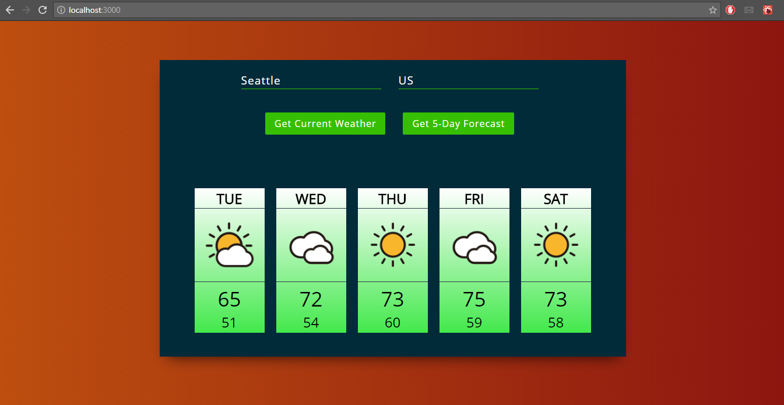

# ReactJS-Weather-App

***

\[**Description**\]
* This app quickly shows the weather of a specified location.  After entering a city and its country, the user can go between seeing the current weather there (temp, humidity, wind speed, overall conditions) or getting a 5-day forecast.  

***

\[**Technologies**\]  
* ReactJS 
* Bootstrap
* OpenWeatherMap API

***

[**How to Run**\]
1. clone/download repo.
2. go to folder path and do npm install.
3. npm start

* Or visit deployment link: https://vyeung.github.io/ReactJS-Weather-App
