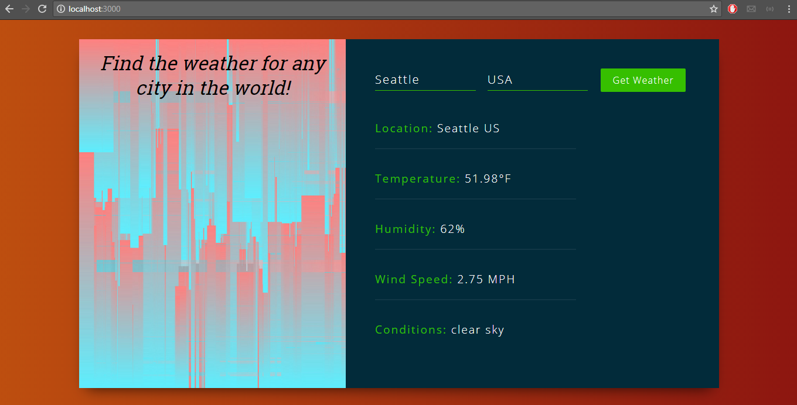

# ReactJS-Weather-App

\[**Technologies**\]  
* ReactJS
* Bootstrap
* OpenWeatherMap API 

***

[**How to Run**\]
1. clone/download repo
2. go to folder path and do npm install
3. then do npm start 
